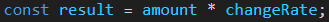

# 🪙 Conversor de monedas API 🪙

## 📜 Sobre el proyecto 

Se trata de un conversor de divisas en línea que permite a los usuarios convertir cantidades de una moneda a otra de manera rápida y sencilla. Utiliza la API de Exchangerate-API para obtener los códigos de las monedas y las tasas de cambio actualizadas en tiempo real. La interfaz está diseñada para ser intuitiva, proporcionando una experiencia de usuario amigable y directa.

## 🛠️ Stack 

   

## 🧑‍🏫 Uso

Supongamos que quieres convertir 100 Euros a Dólares:
+ Ingresa 100 en el campo de entrada.
+ Selecciona Euro en el menú desplegable de la moneda de origen.
+ Selecciona Dólar en el menú desplegable de la moneda de destino.
+ El resultado, que será aproximadamente 108 USD, aparecerá de inmediato.

Este proceso es posible gracias a la lógica implementada en el archivo calculadora.js, que utiliza las tasas de conversión actuales y fórmulas matemáticas para calcular los valores de forma precisa.

¡Te animo a que pruebes como funciona! [Pincha aquí para acceder](https://abrahamgalvezv.github.io/Money_Converter_API/)

## 🧮 Fórmulas de conversión

El cálculo de la conversión se realiza de la siguiente manera:

He decidido usar la condicional if else para esta función

- amount es la cantidad ingresada por el usuario que desea convertir.

- changeRate es la tasa de cambio proporcionada por la API, que representa la equivalencia entre la moneda de origen y la moneda de destino.

El resultado de la conversión se almacena en la constante result, que es el producto de la cantidad introducida por el usuario y la tasa de cambio obtenida. Posteriormente, este valor se muestra en la interfaz con un formato de dos decimales para facilitar la lectura y garantizar la precisión en la visualización.

## 💻 Instalación y Configuración 

1. Clonar el repositorio; git clone https://github.com/usuario/repo-conversor.git

2. Abrir el archivo HTML: Navegar hasta la carpeta del proyecto y abrir index.html en un navegador.

3. Conexión con la API: Asegúrese de que la API de Exchangerate-API esté accesible y que el enlace de la API tenga una clave de acceso válida.

## 🔝 Mejoras Potenciales

- 📲 Interfaz responsiva: Asegurar que el diseño sea completamente responsivo en dispositivos móviles.

- 📈 Agregar más funcionalidades: Como la posibilidad de ver gráficos de variación de las tasas de cambio.

## 📜 Créditos

Este proyecto fue desarrollado como un ejemplo de cómo integrar una API externa en una aplicación web sencilla para realizar conversiones de divisas. Gracias a la API de Exchangerate-API para proporcionar tasas de cambio precisas y actualizadas.

## 📭 Contacto 

 

 
