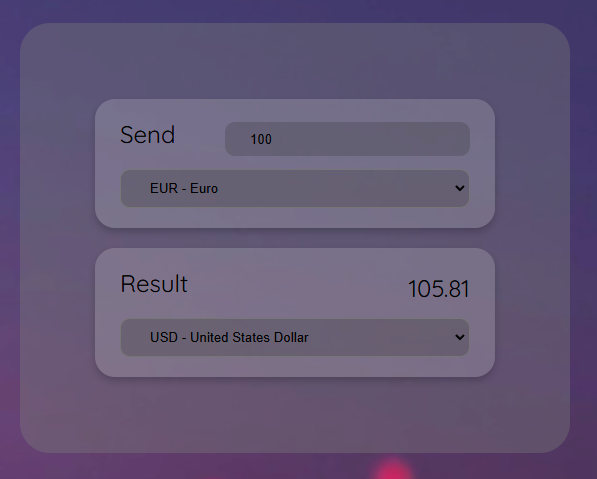

# 🪙 Conversor de monedas 🪙

## 📜 Sobre el proyecto 

Este proyecto es una aplicación web de conversión de divisas que permite convertir entre Euro, Dólar, Yen japonés, Libra esterlina, Franco suizo y Won surcoreano. Ofrece un diseño simple e intuitivo para ingresar un monto en una moneda y obtener la conversión a otra.

## 🛠️ Stack 

   

## 🧑‍🏫 Uso

Supongamos que quieres convertir 100 Euros a Dólares:
+ Ingresa 100 en el campo de entrada.
+ Selecciona Euro en el menú desplegable de la moneda de origen.
+ Selecciona Dólar en el menú desplegable de la moneda de destino.
+ El resultado, que será aproximadamente 108 USD, aparecerá de inmediato.

Este proceso es posible gracias a la lógica implementada en el archivo calculadora.js, que utiliza las tasas de conversión actuales y fórmulas matemáticas para calcular los valores de forma precisa.

## 🧮 Fórmulas de conversión

+ De Euro a Dólar: USD = EUR × 1.08
const dollars = Math.floor(number * 1.08);

+ De Euro a Yen Japonés: JPY = EUR × 165.94
const yenes = Math.floor(number * 165.94);

+ De Euro a Libra Esterlina: GBP = EUR × 0.90
const pounds = Math.floor(number * 0.90);

+ De Euro a Franco Suizo: CHF = EUR × 1.07
const francs = Math.floor(number * 1.07);

+ De Euro a Won Surcoreano: KRW = EUR × 1462.10
const wones = Math.floor(number * 1462.10);

He decidido usar la condicional if else para esta función

## 💻 ¿Quieres comprobar esta función? 

- [Visita el Conversor de monedas](https://abrahamgalvezv.github.io/Money_Converter/)
- Clona este repositorio en tu equipo y comprueba cómo está creado
- Implementa esta función en tu proyecto 

## 📭 Contacto 

 

 